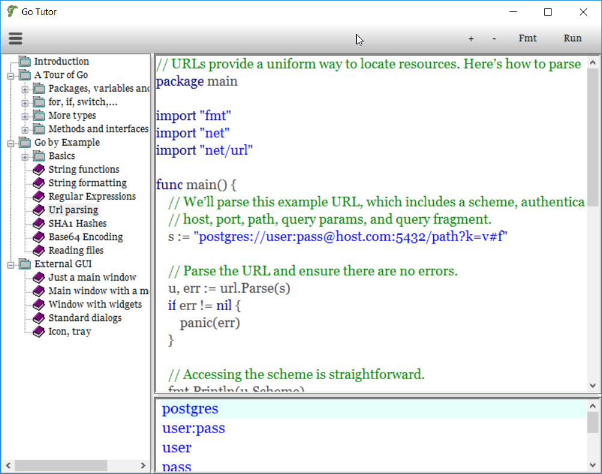

# etutor
Golang tutorial desktop application.

<b> Attention! Since October 6, 2023 we are forced to use two-factor authentication to be able to
   update the repository. Because it's not suitable for me, I will probably use another place for projects.
   Maybe, https://gitflic.ru/, maybe, Sourceforge... Follow the news on my website, http://www.kresin.ru/

   Внимание! С 6 октября 2023 года нас вынуждают использовать двухфакторную идентификацию для того, чтобы 
   продолжать работать над проектами. Поскольку для меня это крайне неудобно, я, возможно, переведу проекты
   на другое место. Это может быть https://gitflic.ru/, Sourceforge, или что-то еще. Следите за новостями
   на моем сайте http://www.kresin.ru/ </b>

To use it you need:
 1) The External packet (Golang GUI framework):  https://github.com/alkresin/external
 2) The GuiServer executable, which may be compiled from sources, hosted in https://github.com/alkresin/guiserver, or downloaded from http://www.kresin.ru/en/guisrv.html or a releases page of Github's repository.

  

It is possible to change some options, editing the etutor.ini:
 - main font ( 'fontmain' tag );
 - editor window font ( 'fontcode' );
 - results window font ( 'fontresult' );
 - results window colors ( 'results' );
 - add/remove keywords to highlite ( 'hilighter' );
 - change the highlite scheme ( 'hiliopt' ), an alternative one is 'hiliopt_far', you may rename it to 'hiliopt' and the current 'hiliopt' to something else;
 - add new tutors, using the 'book' tag.

It is not necessary to keep the code in an xml file. You may use 'path' instead of 'code' with a path to your *.go file.